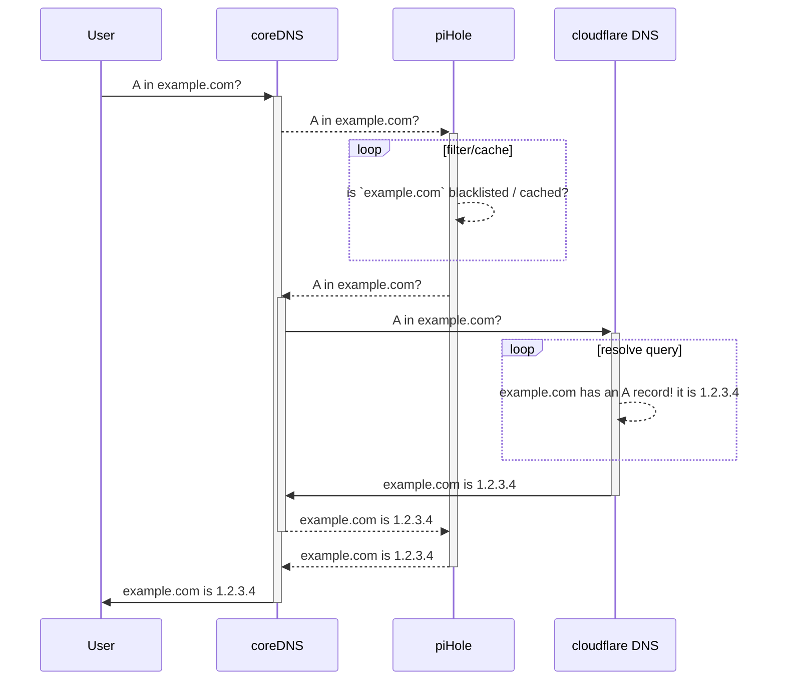

# Sky-hole


What is this?
--

Sky-hole is a hosted [pi-hole](https://pi-hole.net/) as a service. It is designed to be run from a personal server reachable from the Internet and used with a [modern android device](https://fossbytes.com/android-pie-smartphones-list-will-my-phone-get-android-9-update/), but will work with any device that supports [DNS over TLS / DoT](https://en.wikipedia.org/wiki/DNS_over_TLS).

It's basically my version of [erised](https://github.com/eldridgea/erised). I think the only important technical difference is the use of TLS terminator.


Why use it?
--

There are a lot of [good](https://martechtoday.com/state-mobile-ad-blocking-200622) [reasons](https://www.techdirt.com/articles/20160317/09274333934/why-are-people-using-ad-blockers-ads-can-eat-up-to-79-mobile-data-allotments.shtml) to [block](https://www.reddit.com/r/pihole/comments/8pk37g/malware_blocklist_recommendations/) advertising networks, device/usage trackers...etc.

I [love](https://pi-hole.net/donate/) my piHole.

I like the idea of [making DNS private](https://tools.ietf.org/html/rfc7858).

I like the nify [DoT feature in android 9](https://android-developers.googleblog.com/2018/04/dns-over-tls-support-in-android-p.html).

It's never been easier to get [free TLS certificates](https://letsencrypt.org/).

Nor has it ever been easier to [glue](https://github.com/docker/compose) cool [cool bits](https://coredns.io/) of [new software](https://traefik.io/) together to build something new.

Sky-hole will record the DNS queries that would take place off my local LAN and would not be seen in my local LAN's pi-hole logs.
I now have a pretty continuous log of all the DNS requests my device makes which is quite useful data. 

This also goes a long way towards enhancing my understanding of what's on my device and where my device connects to. 

You can learn a lot from the logs!


Why did you do it this way?
--

As it turns out, TLS - when done properly - works really well. Incredibly difficult to tamper with or otherwise sniff, a TLS session is both private and authentic.

Therefore, any filtering of DNS requests must be done before or after the TLS session. 

On android, this is trivial to do if rooted; just add entries as needed to the `/etc/hosts` file on the device. 
If you'd prefer to not root your device, this traditionally meant using some sort of VPN based approach to capture all DNS requests and NAT/Proxy them off to the intended DNS server. 
This is exactly how previous [adblocking](https://kb.adguard.com/en/general/dns-filtering-android) and [dns privacy](https://play.google.com/store/apps/details?id=com.cloudflare.onedotonedotonedotone) solutions have worked in the past.

While I am grateful that Android has good support for many VPNs, there are a few rather unfortunate drawbacks to the VPN approach:

* You can not have multiple VPNs operating at the same time. Operating an on-device VPN based DNS filter will preclude you from encrypting the rest of your traffic over a regular VPN link!

* Tunnels are not instant. Yes, there are [many](https://www.wireguard.com/) different [ways](https://winaero.com/blog/speed-up-openvpn-and-get-faster-speed-over-its-channel/) to [improve](https://www.vpnuniversity.com/learn/vpn-speed) connection set up time, but there will always be a delicate balance between robustness/latency of the VPN link, and device performance / battery life.

* Connection spin up time may take tens of seconds. 
This latency, even if relatively short, can have a very negative impact on the users perception.
Few things are as frustrating as the "time out, try again later" error when you need to fire off a quick query to your phone's assistant.

* Devices may "leak" data to the unprotected network while waiting for the VPN link to be established. 
An improperly configured VPN client may allow traffic to leave the phone through unprotected means while the tunnel is initializing. 

* Some apps and services no not work properly when they detect a VPN connection. 
Netflix won't stream or cache any content, and apps may [not operate correctly](https://github.com/AdguardTeam/AdguardForAndroid/issues/856) when the device is on a VPN connection.

Rooting my device is not an option, and an on device/vpn-based solution is sub-optimal. 

Luckily, Android 9's new DoT implementation allows the user to specify a DNS server to be used **across every network**.
The DNS server given out by the local DHCP server will only be used when the users preferred server is unreachable.


How does it work?
--

Sky-hole an amalgamation of a few technologies:

* **[coreDNS](https://coredns.io/plugins/tls/)** terminates the TLS connection and forwards the DNS query to piHole. As wonderful as piHole is, there is [no native support](https://discourse.pi-hole.net/t/cloudflare-dns-over-tls-port-853-pihole/11689) for TLS termination, so coreDNS is used. Additionally, coreDNS handles the TLS connection to [cloudflare](https://blog.cloudflare.com/announcing-1111/)'s DNS resolver.

* **[Traefik](https://docs.traefik.io/user-guide/examples/#lets-encrypt-support)** coordinates some of the higher-layer networking and makes it easy to add HTTPS to the piHole web ui. The same certificates used for HTTPS are used by coreDNS for the TLS layer.

* **[Lets Encrypt](https://letsencrypt.org/how-it-works/)** issues the TLS certificates.

* **[piHole](https://docs.pi-hole.net/)** caches and filters DNS requests.

* **[Docker](https://docs.docker.com/)** ties it all together

Here's a sequence diagram that should clarify how every bit fits together:




Where arrows show the direction of travel, dotted lines indicate legacy DNS and solid lines indicate a TLS protected DNS query.

The only legacy DNS is between `coredns` and `piHole`; outside of the docker networks on the instance hosting Sky-hole, everything else is TLS secured

Currently, GitHub [does not](https://github.com/github/markup/issues/533) support [mermaid](https://mermaidjs.github.io) diagrams, so if you're reading this and don't see a rendered diagram, [here's a rendered version](https://mermaidjs.github.io/mermaid-live-editor/#/view/eyJjb2RlIjoic2VxdWVuY2VEaWFncmFtXG4gICAgcGFydGljaXBhbnQgVXNlclxuICAgIHBhcnRpY2lwYW50IGNvcmVETlNcbiAgICBwYXJ0aWNpcGFudCBwaUhvbGVcbiAgICBwYXJ0aWNpcGFudCBjbG91ZGZsYXJlIEROU1xuICAgIFVzZXItPj4rY29yZUROUzogQSBpbiBleGFtcGxlLmNvbT9cbiAgICBcbiAgICBjb3JlRE5TLS0-PitwaUhvbGU6IEEgaW4gZXhhbXBsZS5jb20_XG4gICAgXG4gICAgbG9vcCBwcm9jZXNzIHF1ZXJ5XG4gICAgICAgIHBpSG9sZS0tPj5waUhvbGU6IGlzIGBleGFtcGxlLmNvbWAgYmxhY2tsaXN0ZWQgLyBjYWNoZWQ_XG4gICAgZW5kXG4gICAgcGlIb2xlLS0-Pitjb3JlRE5TOiBBIGluIGV4YW1wbGUuY29tP1xuICAgIGNvcmVETlMgLT4-KyBjbG91ZGZsYXJlIEROUzogQSBpbiBleGFtcGxlLmNvbT9cblxuICAgIGxvb3AgcmVzb2x2ZSBxdWVyeVxuICAgICAgICBjbG91ZGZsYXJlIEROUy0tPj5jbG91ZGZsYXJlIEROUzogZXhhbXBsZS5jb20gaGFzIGFuIEEgcmVjb3JkISBpdCBpcyAxLjIuMy40XG4gICAgZW5kXG5cbiAgICBjbG91ZGZsYXJlIEROUyAtPj4tIGNvcmVETlM6IGV4YW1wbGUuY29tIGlzIDEuMi4zLjRcblxuICAgIGNvcmVETlMtLT4-LXBpSG9sZTogZXhhbXBsZS5jb20gaXMgMS4yLjMuNFxuICAgIHBpSG9sZS0tPj4tY29yZUROUzogZXhhbXBsZS5jb20gaXMgMS4yLjMuNFxuICAgIGNvcmVETlMtPj4tVXNlcjogZXhhbXBsZS5jb20gaXMgMS4yLjMuNCIsIm1lcm1haWQiOnsidGhlbWUiOiJkZWZhdWx0In19).


How To?
--

Running Sky-hole is easy, but there are a few hard requirements. You must have:

* A server with:
    * a world-reachable IP address.
    * docker run time
* A "real" [domain](https://en.wikipedia.org/wiki/List_of_Internet_top-level_domains) that you can point to your server.

*Note:*

    The web API and mgmt interface for traefik will be "open". 
    Anything that can send traffic to your host on port `8080` can reach the traefik UI. 
    This is possible to change, but I haven't done so yet.
    Currently, I am using lower-level tools to restrict traffic to traefik's web UI.


With that out of the way, clone this repo onto your server and use your editor of choice to enter a few settings unique to your deployment:

* [`traefik.toml`](docker/vol/traefik/traefik.toml) - must change `acme.email` and `acme.domains.main`

* [`pihole.env`](docker/env/pihole.env) - must change `VIRTUAL_HOST` and `WEBPASSWORD`

* [`docker-compose.yaml`](docker/docker-compose.yaml)       
    * the `domainname` values for each service
    * the `traefik.basic.frontend.rule=Host:` label on the `traefik` container

After your personalization is done, run [`bootstrap.sh`](bootstrap.sh) to get the user/pass you'll use to authenticate against `traefik` and start the containers up!

You should point your device at your domain and observe queries coming in.

* `docker logs -f pihole` to confirm that `pi-hole` has started

* `docker logs -f traefik` to confirm that `traefik` has started and obtained certificates from LE

* `docker logs -f coredns` to confirm that `coredns` has started and found the TLS information and is receiving DNS queries over TLS

This is not a particularly complex project: a few hours to get a working PoC and another few evenings here and there to clean up and document.

Each file should have some blurb about it's purpose, as well as a a comment explaining the reason behind each configuration choice. Documentation always make more sense in context! 


Here's (about) what you should see from `bootstrap.sh`:

```
groot@skyhole:/opt/skyhole$ sudo ./bootstrap.sh
  [INFO]  creating files for docker-compose...
creating /opt/skyhole/docker/vol/traefik/.htpasswd...
Adding password for user somebody

your http credentials are somebody:5or49RZsvBICGkhE
creating /opt/skyhole/docker/vol/traefik/acme.json...
  [INFO]  getting runtime WAN IP configuration...
  [INFO]  beginning container creation...
Pulling pihole (pihole/pihole:latest)...
latest: Pulling from pihole/pihole
f17d81b4b692: Pull complete
2f887aeb5ecf: Pull complete
11a931b774ae: Pull complete
ee11abf8c9a0: Pull complete
db1aa0ba1026: Pull complete
209b32932295: Pull complete
fd3f2be70d49: Pull complete
871a0348ab04: Pull complete
9b9a8fe47e6e: Pull complete
e118b0c50ac8: Pull complete
Pulling coredns (coredns/coredns:latest)...
latest: Pulling from coredns/coredns
e0daa8927b68: Pull complete
b38975a25973: Pull complete
Pulling traefik (traefik:latest)...
latest: Pulling from library/traefik
7a433ecdf92b: Pull complete
9c63ad623dc3: Pull complete
Building inotify
Step 1/8 : FROM alpine:latest
latest: Pulling from library/alpine
cd784148e348: Pull complete
Digest: sha256:46e71df1e5191ab8b8034c5189e325258ec44ea739bba1e5645cff83c9048ff1
Status: Downloaded newer image for alpine:latest
 ---> 3f53bb00af94
Step 2/8 : RUN apk --update upgrade
 ---> Running in 9e8e530050f6
fetch http://dl-cdn.alpinelinux.org/alpine/v3.8/main/x86_64/APKINDEX.tar.gz
fetch http://dl-cdn.alpinelinux.org/alpine/v3.8/community/x86_64/APKINDEX.tar.gz
(1/2) Upgrading busybox (1.28.4-r2 -> 1.28.4-r3)
Executing busybox-1.28.4-r3.post-upgrade
(2/2) Upgrading ssl_client (1.28.4-r2 -> 1.28.4-r3)
Executing busybox-1.28.4-r3.trigger
OK: 4 MiB in 13 packages
Removing intermediate container 9e8e530050f6
 ---> 5231464423e4
Step 3/8 : RUN apk add --no-cache --update inotify-tools curl
 ---> Running in 263c3775ff95
fetch http://dl-cdn.alpinelinux.org/alpine/v3.8/main/x86_64/APKINDEX.tar.gz
fetch http://dl-cdn.alpinelinux.org/alpine/v3.8/community/x86_64/APKINDEX.tar.gz
(1/6) Installing ca-certificates (20171114-r3)
(2/6) Installing nghttp2-libs (1.32.0-r0)
(3/6) Installing libssh2 (1.8.0-r3)
(4/6) Installing libcurl (7.61.1-r1)
(5/6) Installing curl (7.61.1-r1)
(6/6) Installing inotify-tools (3.20.1-r1)
Executing busybox-1.28.4-r3.trigger
Executing ca-certificates-20171114-r3.trigger
OK: 6 MiB in 19 packages
Removing intermediate container 263c3775ff95
 ---> 2056b193abd6
Step 4/8 : RUN rm -rf /var/cache/apk/*
 ---> Running in a6d571afcbaf
Removing intermediate container a6d571afcbaf
 ---> 8e551a6bb72e
Step 5/8 : ADD init.sh /init.sh
 ---> 66359b72b9b7
Step 6/8 : RUN chmod 750 /init.sh
 ---> Running in 358214ef97e3
Removing intermediate container 358214ef97e3
 ---> 6ae1595b3374
Step 7/8 : WORKDIR /tmp
 ---> Running in 3b414331f9d4
Removing intermediate container 3b414331f9d4
 ---> 0011716f6139
Step 8/8 : ENTRYPOINT ["/init.sh"]
 ---> Running in d0e412cc950b
Removing intermediate container d0e412cc950b
 ---> 8054b35e9abe

Successfully built 8054b35e9abe
Successfully tagged docker_inotify:latest
WARNING: Image for service inotify was built because it did not already exist. To rebuild this image you must use `docker-compose build` or `docker-compose up --build`.
Building keys
Step 1/7 : FROM alpine:latest
 ---> 3f53bb00af94
Step 2/7 : RUN apk --update upgrade
 ---> Using cache
 ---> 5231464423e4
Step 3/7 : RUN apk add --no-cache --update jq
 ---> Running in f1b6b2ed62c9
fetch http://dl-cdn.alpinelinux.org/alpine/v3.8/main/x86_64/APKINDEX.tar.gz
fetch http://dl-cdn.alpinelinux.org/alpine/v3.8/community/x86_64/APKINDEX.tar.gz
(1/2) Installing oniguruma (6.8.2-r0)
(2/2) Installing jq (1.6_rc1-r1)
Executing busybox-1.28.4-r3.trigger
OK: 5 MiB in 15 packages
Removing intermediate container f1b6b2ed62c9
 ---> 5bfacb933288
Step 4/7 : RUN rm -rf /var/cache/apk/*
 ---> Running in a7efac0a3bb8
Removing intermediate container a7efac0a3bb8
 ---> dfd396b6fd32
Step 5/7 : COPY keys.sh /keys.sh
 ---> 80d094bb305a
Step 6/7 : RUN chmod 750 /keys.sh
 ---> Running in f2f35d6f665c
Removing intermediate container f2f35d6f665c
 ---> 61b76697fbda
Step 7/7 : ENTRYPOINT ["/keys.sh"]
 ---> Running in 7d7c7fdff72a
Removing intermediate container 7d7c7fdff72a
 ---> d6becf87c6cf

Successfully built d6becf87c6cf
Successfully tagged docker_keys:latest
WARNING: Image for service keys was built because it did not already exist. To rebuild this image you must use `docker-compose build` or `docker-compose up --build`.
Creating pihole  ... done
Creating inotify ... done
Creating keys    ... done
Creating coredns ... done
Creating traefik ... done
  [INFO]  Should be good to go!
```

ToDo & Future work:
--

* see the many `# TODO:` comments pointing out ways to make various components more flexible or robust

* leverage the coreDNS [prometheus](https://prometheus.io/) [support](https://github.com/coredns/coredns/tree/master/plugin/metrics)

* add the wonderful [portainer](https://www.portainer.io/) to make it a bit easier to manage the various containers

* secure portainer behind traefik

* secure the traefik webUI as well

* automatically apply updates to the upstream containers


*Note:*

    I can not and will not provide much support for Sky-hole.
    
    This works well enough for me. if you can take this and make it better, that's fantastic. If you don't mind, please submit a PR; improvements are more than welcome!

    If you notice something dangerous or know of a way to make this more performant, secure, or reliable, open an issue!
